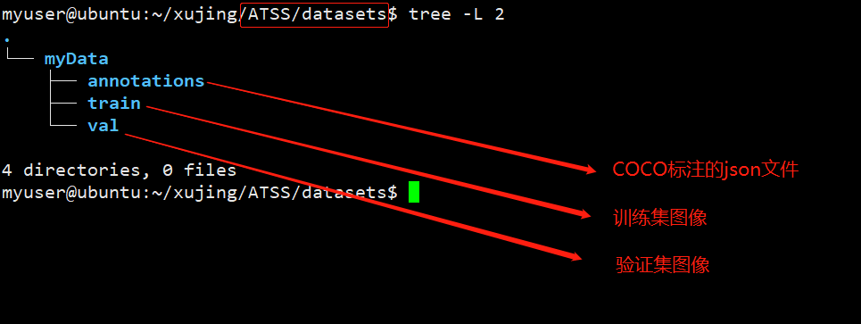
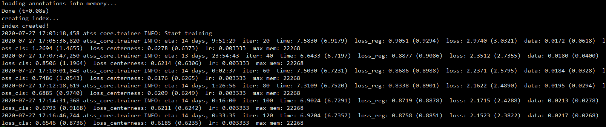
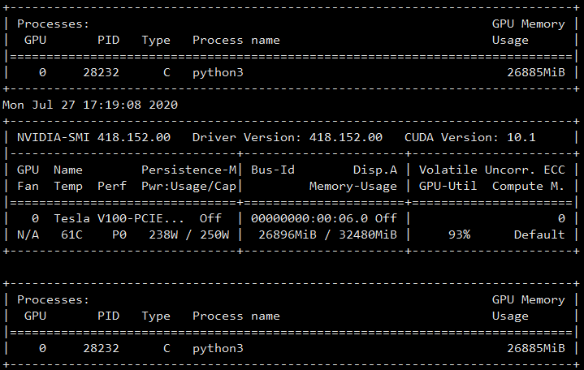
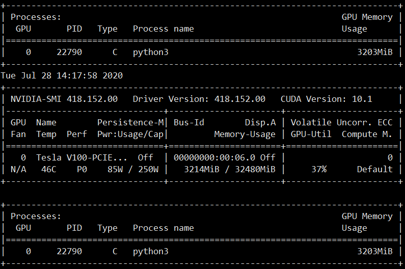
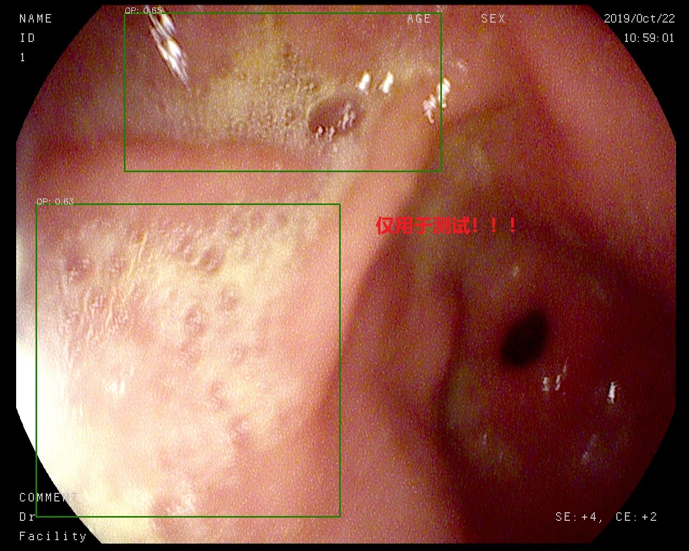
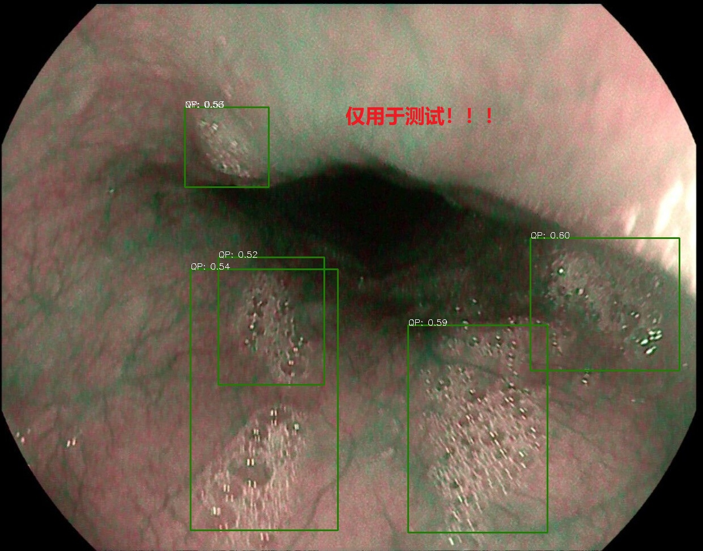

### ATSS训练自己的数据集

[[Repo](https://github.com/sfzhang15/ATSS)]   [[paper](https://arxiv.org/abs/1912.02424)]

### 1.Introduction

anchor-based和anchor-free最本质的区别是正负样本的定义（**how to define positive and negative training samples**). ATSS（Adaptive Training Sample Selection)可以自动选择正负样本基于一些统计学的指标。ATSS提高了anchor based和anchor free的模型的识别精度，使他们之间的gap变小。

### 2.Installation


对于环境的要求

```shell
Pytorch>=1.0
torchvision==0.2.1
cocoapi
yacs
matplotlib
GCC>=4.9 <6.0
python-opencv
```

安装：

```shell
# 自行安装pytorch和torchvision
pip3 install ninja yacs cython matplotlib tqdm
# 安装cocoapi
git clone https://github.com/cocodataset/cocoapi.git
cd cocoapi/PythonAPI
python3 setup.py build_ext install
# atss
git clone https://github.com/sfzhang15/ATSS.git
cd ATSS

# cuda 9.0 ,9.2
sudo CUDA_HOST_COMPILER=/usr/bin/gcc-5 python3 setup.py build develop --no-deps
```

### 3.数据准备

将数据按照MS COCO的数据格式准备,在项目根目录下新建文件夹`datasets/myData`



修改项目根目录下`ATSS\atss_core\config\paths_catalog.py`文件

```python
class DatasetCatalog(object):
    DATA_DIR = "datasets"
    DATASETS = {

        "coco_2017_train": {
            "img_dir": "myData/train",
            "ann_file": "myData/annotations/instances_train.json"
        },
        "coco_2017_val": {
            "img_dir": "myData/val",
            "ann_file": "myData/annotations/instances_val.json"
        },
```

### 4.修改模型配置文件

修改模型配置文件`ATSS\configs\atss`,在该文件夹下新建文件夹比如`wei_score`,将`atss_dcnv2_X_101_64x4d_FPN_2x.yaml`配置文件拷贝到该文件夹并做如下修改（部分参数可自行修改）

```yaml
MODEL:
  META_ARCHITECTURE: "GeneralizedRCNN"
  WEIGHT: "catalog://ImageNetPretrained/FAIR/20171220/X-101-64x4d"  #<--------预训练权重加载
  RPN_ONLY: True
  ATSS_ON: True
  BACKBONE:
    CONV_BODY: "R-101-FPN-RETINANET"
  RESNETS:
    STRIDE_IN_1X1: False
    BACKBONE_OUT_CHANNELS: 256
    NUM_GROUPS: 64
    WIDTH_PER_GROUP: 4
    STAGE_WITH_DCN: (False, False, True, True)
    WITH_MODULATED_DCN: True
    DEFORMABLE_GROUPS: 1
  RETINANET:
    USE_C5: False
  ATSS:
    ANCHOR_SIZES: (64, 128, 256, 512, 1024) # 8S
    ASPECT_RATIOS: (1.0,)
    SCALES_PER_OCTAVE: 1
    USE_DCN_IN_TOWER: True
    POSITIVE_TYPE: 'ATSS' # how to select positves: ATSS (Ours) , SSC (FCOS), IoU (RetinaNet)
    TOPK: 9 # topk for selecting candidate positive samples from each level
    REGRESSION_TYPE: 'BOX' # regressing from a 'BOX' or a 'POINT'
DATASETS:
  TRAIN: ("coco_2017_train",)  #<----------与数据集对应
  TEST: ("coco_2017_val",)
INPUT:
  MIN_SIZE_RANGE_TRAIN: (640, 800)
  MAX_SIZE_TRAIN: 1333
  MIN_SIZE_TEST: 800
  MAX_SIZE_TEST: 1333
DATALOADER:
  SIZE_DIVISIBILITY: 32
SOLVER:
  BASE_LR: 0.01
  WEIGHT_DECAY: 0.0001
  STEPS: (120000, 160000)
  MAX_ITER: 180000
  IMS_PER_BATCH: 16   #<-----------batch size可以修改
  WARMUP_METHOD: "constant"
TEST:
  BBOX_AUG:
    ENABLED: True   #<--------------多尺度测试
    VOTE: True
    VOTE_TH: 0.66
    MERGE_TYPE: "soft-vote"
    H_FLIP: True
    SCALES: (400, 500, 600, 640, 700, 900, 1000, 1100, 1200, 1300, 1400, 1800)
    SCALE_RANGES: [[96, 10000], [96, 10000], [64, 10000], [64, 10000], [64, 10000], [0, 10000], [0, 10000], [0, 256], [0, 256], [0, 192], [0, 192], [0, 96]]
    MAX_SIZE: 3000
    SCALE_H_FLIP: True
```

### 5.模型训练

```shell
python3 -m torch.distributed.launch \
    --nproc_per_node=8 \
    --master_port=$((RANDOM + 10000)) \
    tools/train_net.py \
    --config-file configs/atss/atss_R_50_FPN_1x.yaml \
    DATALOADER.NUM_WORKERS 2 \
    OUTPUT_DIR training_dir/atss_R_50_FPN_1x
    
# 1.如果你使用少的GPU,可以更改--nproc_per_node，指定GPU数量，无需修改其他，batch size不依赖于该参数
# 2.如果你想改变batch size 则修改SOLVER.IMGS_PER_BATCH这个配置项中的参数
# 3.训练的模型江北保存在 OURPUT_DIR
# 4.如果想修改训练的backbone,可以修改--config-file
```

```shell
python3 -m torch.distributed.launch \
    --nproc_per_node=1 \
    tools/train_net.py \
    --config-file configs/atss/wei_score/atss_dcnv2_X_101_64x4d_FPN_2x.yaml \
    DATALOADER.NUM_WORKERS 2 \
    OUTPUT_DIR checkpoint/atss_dcnv2_X_101_64x4d_FPN_2x
```

```shell
python3 tools/train_net.py \
    --config-file configs/atss/wei_score/atss_dcnv2_X_101_64x4d_FPN_2x.yaml \
    DATALOADER.NUM_WORKERS 2 \
    OUTPUT_DIR checkpoint/atss_dcnv2_X_101_64x4d_FPN_2x\
    SOLVER.IMS_PER_BATCH 8
# 单卡 V100 32G能开到batch size 8
```

出现如下界面，则正常开始训练



训练过程中GPU的占用情况

```shell
nvidia-smi -lms 200
```



### 6.模型推断

```shell
python3 tools/test_net.py \
    --config-file configs/atss/wei_score/atss_dcnv2_X_101_64x4d_FPN_2x.yaml \
    MODEL.WEIGHT ./checkpoint/atss_dcnv2_X_101_64x4d_FPN_2x/model_0010000.pth \
    TEST.IMS_PER_BATCH 1\
    OUTPUT_DIR result
# 1.MODEL.WEIGHT 是训练模型的存放地址
# 2.TEST.IMS_PER_BATCH是测试的batch size 可以设为1
# 3.--config-file可以修改模型的配置文件和训练后的模型保持一致
```

关于视频的测试可以参考`demo`文件夹下的测试脚本，内有详细的说明！

测试结果：

```shell
loading annotations into memory...
Done (t=0.00s)
creating index...
index created!
2020-07-28 13:00:05,839 atss_core.inference INFO: Start evaluation on coco_2017_val dataset(285 images).
100%|█████████████████████████████████████████████████████████████████████████████████████████████████████████████████████████| 285/285 [37:48<00:00,  7.96s/it]
2020-07-28 13:37:54,177 atss_core.inference INFO: Total run time: 0:37:48.337468 (7.9590788347679275 s / img per device, on 1 devices)
2020-07-28 13:37:54,177 atss_core.inference INFO: Model inference time: 0:37:45.241220 (7.948214806171886 s / img per device, on 1 devices)
2020-07-28 13:37:54,201 atss_core.inference INFO: Preparing results for COCO format
2020-07-28 13:37:54,202 atss_core.inference INFO: Preparing bbox results
2020-07-28 13:37:54,338 atss_core.inference INFO: Evaluating predictions
Loading and preparing results...
DONE (t=0.36s)
creating index...
index created!
Running per image evaluation...
Evaluate annotation type *bbox*
DONE (t=2.24s).
Accumulating evaluation results...
DONE (t=0.37s).
 Average Precision  (AP) @[ IoU=0.50:0.95 | area=   all | maxDets=100 ] = 0.575
 Average Precision  (AP) @[ IoU=0.50      | area=   all | maxDets=100 ] = 0.762
 Average Precision  (AP) @[ IoU=0.75      | area=   all | maxDets=100 ] = 0.703
 Average Precision  (AP) @[ IoU=0.50:0.95 | area= small | maxDets=100 ] = -1.000
 Average Precision  (AP) @[ IoU=0.50:0.95 | area=medium | maxDets=100 ] = 0.391
 Average Precision  (AP) @[ IoU=0.50:0.95 | area= large | maxDets=100 ] = 0.593
 Average Recall     (AR) @[ IoU=0.50:0.95 | area=   all | maxDets=  1 ] = 0.449
 Average Recall     (AR) @[ IoU=0.50:0.95 | area=   all | maxDets= 10 ] = 0.808
 Average Recall     (AR) @[ IoU=0.50:0.95 | area=   all | maxDets=100 ] = 0.865
 Average Recall     (AR) @[ IoU=0.50:0.95 | area= small | maxDets=100 ] = -1.000
 Average Recall     (AR) @[ IoU=0.50:0.95 | area=medium | maxDets=100 ] = 0.843
 Average Recall     (AR) @[ IoU=0.50:0.95 | area= large | maxDets=100 ] = 0.866
Maximum f-measures for classes:
[0.7241379310344828, 0.7339771729587358, 0.6219058553386911]
Score thresholds for classes (used in demos for visualization purposes):
[0.6439446806907654, 0.5525452494621277, 0.6701372265815735]
2020-07-28 13:37:58,352 atss_core.inference INFO: OrderedDict([('bbox', OrderedDict([('AP', 0.5753148283391758), ('AP50', 0.7616533791613537), ('AP75', 0.7030910236503778), ('APs', -1.0), ('APm', 0.3910203379699095), ('APl', 0.5934576896107282)]))])

```

单张图像的推断结果的可视化,修改`demo/predictor.py`

```python
CATEGORIES = [
"__background",
"QP",
"NY",
"QG",
]
```

修改`demo/atss_demo.py`

```python
# Copyright (c) Facebook, Inc. and its affiliates. All Rights Reserved.
import argparse
import cv2, os

from atss_core.config import cfg
from predictor import COCODemo

import time


def main():
    parser = argparse.ArgumentParser(description="PyTorch Object Detection Webcam Demo")
    parser.add_argument(
        "--config-file",
        default="../configs/atss/wei_score/atss_dcnv2_X_101_64x4d_FPN_2x.yaml",  # <-----模型配置文件
        metavar="FILE",
        help="path to config file",
    )
    parser.add_argument(
        "--weights",
        default="../checkpoint/atss_dcnv2_X_101_64x4d_FPN_2x/model_0010000.pth",      #<-----------训练模型地址
        metavar="FILE",
        help="path to the trained model",
    )
    parser.add_argument(
        "--images-dir",
        default="../datasets/myData/val",   #<------------测试图像的路径
        metavar="DIR",
        help="path to demo images directory",
    )
    parser.add_argument(
        "--min-image-size",
        type=int,
        default=800,
        help="Smallest size of the image to feed to the model. "
            "Model was trained with 800, which gives best results",
    )
    parser.add_argument(
        "opts",
        help="Modify model config options using the command-line",
        default=None,
        nargs=argparse.REMAINDER,
    )

    args = parser.parse_args()

    # load config from file and command-line arguments
    cfg.merge_from_file(args.config_file)
    cfg.merge_from_list(args.opts)
    cfg.MODEL.WEIGHT = args.weights

    cfg.freeze()

    # The following per-class thresholds are computed by maximizing
    # per-class f-measure in their precision-recall curve.
    # Please see compute_thresholds_for_classes() in coco_eval.py for details.

     thresholds_for_classes = [
        0.5, 0.5, 0.5,
        ]

    demo_im_names = os.listdir(args.images_dir)

    # prepare object that handles inference plus adds predictions on top of image
    coco_demo = COCODemo(
        cfg,
        confidence_thresholds_for_classes=thresholds_for_classes,
        min_image_size=args.min_image_size
    )

    for im_name in demo_im_names:
        img = cv2.imread(os.path.join(args.images_dir, im_name))
        if img is None:
            continue
        start_time = time.time()
        composite = coco_demo.run_on_opencv_image(img)
        print("{}\tinference time: {:.2f}s".format(im_name, time.time() - start_time))
        cv2.imwrite("../result/"+im_name,composite)
    #   cv2.imshow(im_name, composite)
    # print("Press any keys to exit ...")
    # cv2.waitKey()
    # cv2.destroyAllWindows()

if __name__ == "__main__":
    main()

```

```shell
python3 atss_demo.py
```

```shell
38987686174811ea853300e04c510bc1.jpg    inference time: 0.21s
071bbe9c174811ea869900e04c510bc1.jpg    inference time: 0.25s
fa563722174711ea882300e04c510bc1.jpg    inference time: 0.25s
20200513_2019111816282724.jpg   inference time: 0.25s
20200513_264_20181112_two.jpg   inference time: 0.21s
42c06e10174811eab9b200e04c510bc1.jpg    inference time: 0.21s
20200513_1133_20181112_two.jpg  inference time: 0.21s
2a84fcac174811eaa51600e04c510bc1.jpg    inference time: 0.21s
f270f22e174711eaa22b00e04c510bc1.jpg    inference time: 0.21s
3b2db136174811eab7b300e04c510bc1.jpg    inference time: 0.21s
20200513_2019111812416486.jpg   inference time: 0.21s
1e53fbf4174811ea9e8b00e04c510bc1.jpg    inference time: 0.21s
21695cec174811eaba1100e04c510bc1.jpg    inference time: 0.21s
# 推断时间在V100上210ms
```

在V100上的推断过程中的显存占用：



### 7.部分测试结果展示



